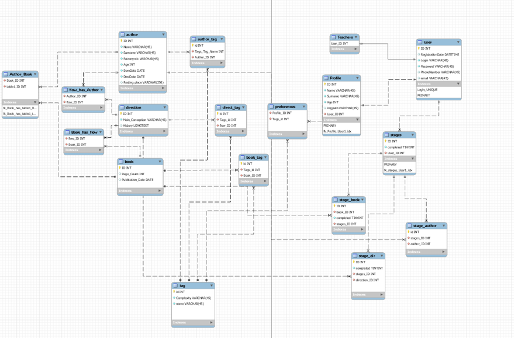
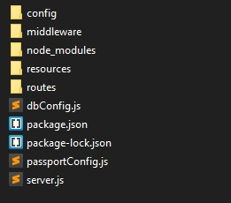

PhilMate
==============

***Содержание:***

- [Введение](#Introduction)
- [Программные средства и технологии](#soft)
- [Как с этим работать ?](#How2work)
- [How it works](#HowItWorks)

# Введение 

Философия - наука замысловатая. Многим из нас сложно осваивать эту гуманитарную область знания, особенно, когда мы говорим про студентов, которые, вкупе с философией, должны еще параллельно осваивать десятки образовательных предметов. Это гигантская нагрузка.А если мы сейчас начнем разбираться в спецификах философии,к примеру,в трансцендентальном единстве апперцепции, так вообще можно свихнуться. Да и человек, желающий изучить частные моменты философии, взяв в руки образовательную литературу, сразу же закинет ее в дальний угол антресоли, ведь фрагментация информации в таких книжках усложняет поиск информации в разы.  
 **PhilMate** — это проект, позволяющий изучать философию благодаря адаптивной генерации маршрута знаний.  Суть проекта в построении образовательной траектории изучения философии на основе конкретных предпочтений пользователя. Его основная цель - избежать избыточности при изучении предмета. 

## Программные средства и технологии 

1. Node.js

2. Express.js (фреймворк-основа для веб приложения и REST API соответственно )

3. PostgreSQL (основная СУБД)

4. React (frontend)
  

## Как с этим работать ? 

### Выше представлена схема базы данных проекта на основе которой ниже обьясняется алгоритм работы с программой

1.   Основные сущности:  
        * **author** - Философ (пример: Гегель,Ницше,Кант,Гёте,Аристотель etc.)
        * **direction** - Философское направление (пример: идеализм,рационализм,диалектизм,объективизм etc.)
        * **book** - Философская книга,трактат,научный труд (пример: Критика чистого разума,Фауст,Так говорил Заратустра etc.)
2. Реализация связи **многие-ко-многим** осуществляется посредством промежуточных сущностей (пример: author_book, так как у одного автора может быть несколько трактатов, как и у одного трактата может быть несколько авторов) 
   
3. У пользователя системы можеть быть 1 из 4 основных ролей:  
    * admin - Администратор. Только он способен перевести обычного зарегистрированного пользователя в роль "teacher"
    * teacher - Аккредитованный педагог, на плечах которого лежит добавление и обновление информации в системе(добавление и обновление сущностей author,direction,book,tag)
    * registered user - Обычный зарегистрированный пользователь, имеющий в личном кабинете список предпочитаемых направлений изучения в виде тэгов
    * unregistered user - Незарегистрированный пользователь, имеющий возможности исключительно ознакомительного характера

4.  Зарегистрированный пользователь может выбрать набор тэгов, согласно которым будет сконструирован маршрут изучения. Данная информация хранится в сущности preferences

5.  На основании сущности preferences генерируются этапы маршрута

6.  У каждого этапа есть атрибут **completed**. По прохождении этапа completed меняет свое значение

## How it works 

В основе архитектуры системы лежит трехзвенная аппаратная архитектура. Сервер приложения, включенный в эту схему, позволяет организовать RESTful API. Для реализации [REST API](https://restfulapi.net/) используется фреймворк [Expess.js](https://www.npmjs.com/package/express) для платформы node.js. 

В качестве СУБД выступает PostgreSQL. 

В директории backend репозитория расположены следующие директории:

   

1. config
    * содержит в себе конфигурационные файлы для сервера и подключения к базе данных
2. middleware
    * содержит в себе функции промежуточной обработки.В частности, обработка аутентификации и проверка на роль пользователя
3. node_modules
    * Библиотеки и модули, подгружаемые Node js
4. resources
    * пользовательские данные (пример: аватар аккаунта)
5. routes
    * директория с файлами обработки HTTP запросов

Остальные файлы в директории backend являются связующими.DbConfig создаёт пул подключения к бд. JSON файлы - параметры nodejs. PassportConfig - обработка авторизации и аутентификации. Server - основной файл в котором происходит вся магия запуска сервера, перераспределения роутинга и делегация его на routes.
